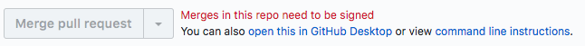

paas-do-not-merge
=================

A chrome extenstion which disables the merge button in [alphagov/paas-cf] and
[alphagov/paas-bootstrap] with CSS:

> 

This is useful because the pipeline in these repositories checks that the
commit it's deploying is signed by someone it trusts. Merges from the GitHub UI
will not be deployed.

See https://team-manual.cloud.service.gov.uk/team/working_practices/#merging-pull-requests

Installation
------------

* Clone this repository
* Navigate to chrome://extensions
* Enable developer mode with the switch in the top right corner
* Select `Load unpacked`
* Upload the directory of your clone

[alphagov/paas-cf]: https://github.com/alphagov/paas-cf
[alphagov/paas-bootstrap]: https://github.com/alphagov/paas-bootstrap
